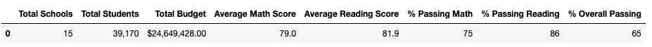
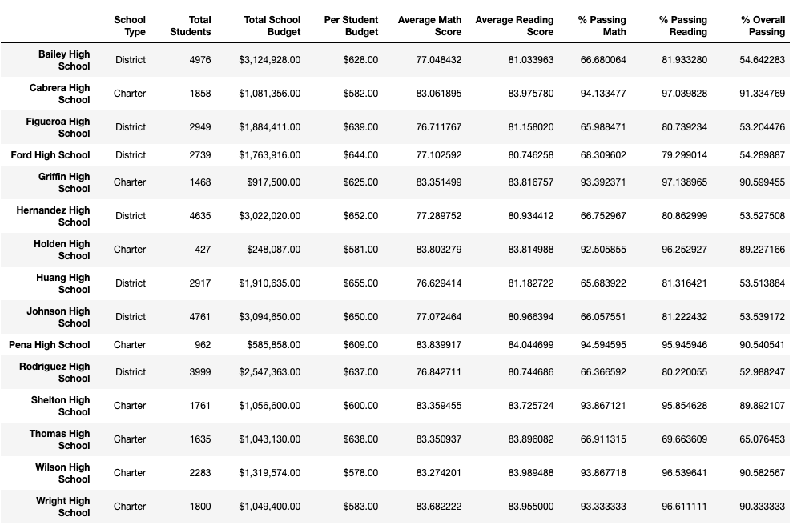
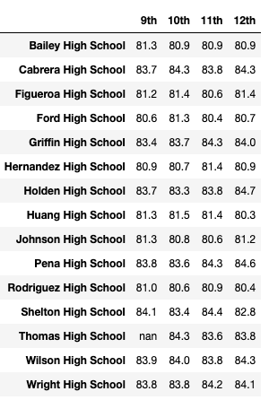

# School_District_Analysis

## Overview of the school district analysis: 
We are helping analyze data on student funding and student standardized test scores to assit the school on making decisions regarding buget and priorities.

The school board has notified us that we can see evidence of academic dishonesty specifically, reading and math grades for Thomas High School ninth graders, appears to have been altered.

Our goal is to replace the math and reading scores for Thomas High School with NaNs and then perform analysis on our the school district dataset 

## Results: 
* How is the district summary affected?

  - When analysing the district summary we see the the average math score increased by 0.1, the average reading score remainedd the same, the percentage passing math increased by .2%, the percentage passing reading increased by .3%, and the overall passing percent increased by .1%.
  #### Before
  
  #### After
  

* How is the school summary affected?

  

  After updating the school summary using only the 10th-12th graders from Thomas High School we see the % Passing Math increased from 66.911315 to 93.185690, % Passing Reading increased from 69.663609 to 97.018739, and % Overall Passing increased from 65.076453 to 90.630324 for Thomas High School.
  

* How does replacing the ninth graders’ math and reading scores affect Thomas High School’s performance relative to the other schools?

  * After replacing the 9th graders math and reading scores we see that Thomas High Schools performance went from the school with the 8th best % Overall Passing to the 2nd.
 

* How does replacing the ninth-grade scores affect the following:

  - ### Reading scores by grade for Thomas High School
    #### Before - Average 83.975
   

    #### After - Average 83.9
   

  - ### Math scores by grade
    #### Before - Average 83.85

   

    #### After - Average 83.9

   

  - ### Scores by school spending - Change is not noticable

   #### Before

   

    #### After

   

  - ### Scores by school size - Change is not noticable

   #### Before

   

    #### After

   

  - ### Scores by school type - Change is not noticable

   #### Before

   

   #### After

   

## Summary: 
 - The scores of math increased by 26.27 %  and the scores of reading increased by 27.36 after replacing 9th grade scores with NaNs
 - Overall passing rete increased by 25.56 % after replacing 9th grade scores with NaNs
 - When only looking at the % Passing Reading, we see the school went from last (15th place) to the 3rd best school
 - When only looking at the % Passing math, we see the school went from the 9th best school to the to the 7th best school
 
